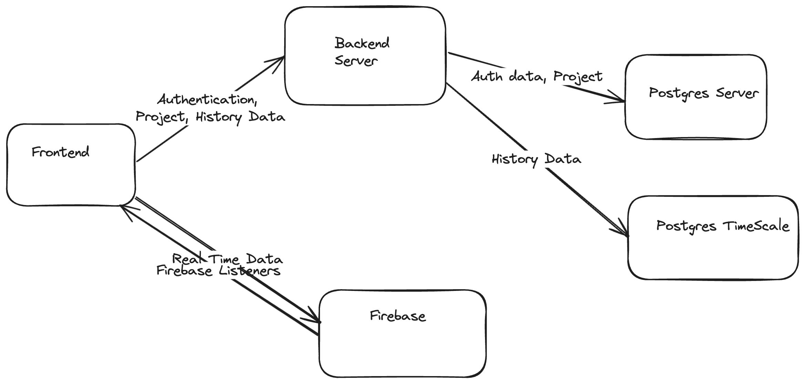

# System Architecture

## Tools Considered

    1. Next JS
    2. Typescript
    3. Firebase (Real Time Database)
    4. Docker
    5. Redux Toolkit
    6. Jest
    7. React Testing library
    8. Cypress
    9. Firebase listeners
    10. TimeScale DB

## Overall System Diagram

    
